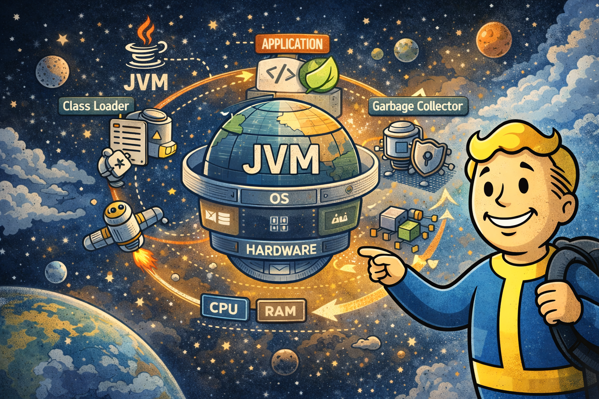
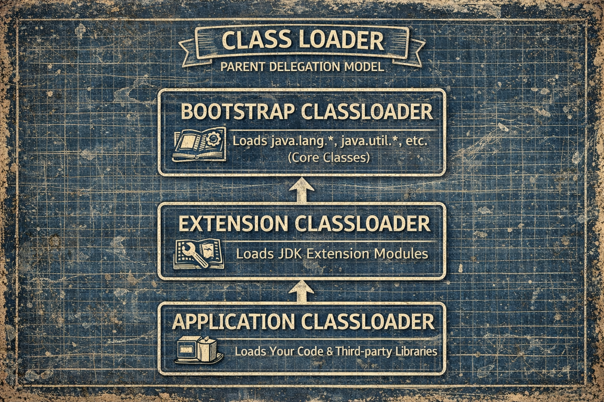

# What is JVM



## 前言

每個 Java 工程師每天都在做同一件事：寫好程式碼，按下執行，然後等程式跑起來。但如果問一個問題——當你輸入 `java -jar app.jar` 按下 Enter 之後，到你的第一行程式碼真正被 CPU 執行之間，到底發生了什麼事？大部分人答不出來。

我們習慣把 JVM 當成一個黑盒子，程式丟進去就會跑。但事實上，JVM 是一台設計極其精密的虛擬機器，從 class 檔案的載入、記憶體的分配、到最終轉換成機器碼執行，每一步都有明確的架構設計。理解這台機器怎麼運作，是理解後面所有 Java 效能問題、框架設計、甚至 Cloud Native 架構選擇的基礎。

## 技術背景

在開始之前，先釐清一個最基本的誤解：**Java 到底是編譯語言還是直譯語言？**

答案是：兩者都是。

你寫的 Java 程式碼，會先被 `javac` 編譯成 Bytecode（`.class` 檔案），這是一種平台無關的中間表示。然後 JVM 會載入這些 Bytecode，一開始用 Interpreter 逐行解譯執行，當它發現某段程式碼被頻繁呼叫時，JIT Compiler 會介入，把那段 Bytecode 直接編譯成該平台的 native machine code。

所以 Java 程式碼其實經過了 **兩次編譯**：一次是 javac，一次是 JIT。這也是為什麼 Java 程式剛啟動時比較慢，跑一陣子之後會變快——因為 JIT 還沒開始工作。

### JDK、JRE、JVM：一層包一層

講 JVM 之前，先分清楚三個常被混用的名詞：

```
JDK（開發工具組）＝ JRE ＋ javac、javap、jar、jshell…
└── JRE（執行環境）＝ JVM ＋ 核心類別庫
    └── JVM（虛擬機器）：真正執行 Bytecode 的那台「機器」
```

| | 是什麼 | 誰需要 |
|---|---|---|
| JVM | 執行 Bytecode 的虛擬機器 | （被 JRE 包在裡面） |
| JRE | JVM ＋ 類別庫，足以「跑」Java 程式 | 只需要執行程式的環境 |
| JDK | JRE ＋ 開發工具 | 開發者 |

> JDK 9 之後官方不再單獨發行 JRE——現在一律裝 JDK。

而 JVM 的內部架構可以分成三大區塊：

1. Class Loader Subsystem
2. Runtime Data Areas
3. Execution Engine


### Class Loader Subsystem

JVM 不會一次把所有 class 都載入記憶體，而是 **用到的時候才載入**（Lazy Loading）。載入的過程分成三個階段：

1. **Loading**：找到 `.class` 檔案，讀取 Bytecode
2. **Linking**：驗證 Bytecode 合法性、分配靜態變數記憶體、解析符號參考
3. **Initialization**：執行 `<clinit>`，也就是 static block 和靜態變數的初始化

Class Loader 本身有三層，採用 **雙親委派模型（Parent Delegation Model）**：



> Java 9 起中間層改名為 **Platform ClassLoader**（取代舊的 Extension ClassLoader，extension 機制已移除）。圖中為 Java 8 時代的舊名。

當你的程式需要某個 class 時，Application ClassLoader 不會自己先找，而是先委託給上層的 Platform ClassLoader，Platform 再委託給 Bootstrap。只有當上層找不到時，才會由下層自己來載入。

這就是為什麼你不能自己寫一個 `java.lang.String` 來覆蓋 JDK 的版本——Bootstrap ClassLoader 永遠會先載入它自己的 `String`，你的版本根本沒機會被載入。

不過雙親委派是「預設策略」而不是鐵律——Tomcat 的應用隔離、熱更新工具都靠繞過它來實現，深入討論見 [ClassLoader 的開放性](deep-classloader.md)。

### Runtime Data Areas

這是 JVM 的記憶體佈局，每個區域有不同的用途和生命週期。

**Method Area（方法區）**

所有 thread 共享。存放每個 class 的結構資訊：class 名稱、父類別、方法定義、常量池（Constant Pool）、靜態變數。在 Java 8 之後，這個區域的實作從 PermGen 改成了 Metaspace，直接使用 native memory，不再受固定大小限制。

**Heap（堆積）**

所有 thread 共享。所有物件實例和陣列都在這裡分配。這是 Garbage Collector 管理的主要區域。

**JVM Stack（虛擬機器堆疊）**

每個 thread 各自擁有一個。每當呼叫一個方法，就會在 Stack 上建立一個 **Stack Frame**，裡面包含：

- 區域變數表（Local Variable Table）
- 運算元堆疊（Operand Stack）
- 方法回傳位址

方法執行完畢，Frame 就會被彈出。如果你的遞迴太深，Stack 空間不夠，就會拿到 `StackOverflowError`。

**PC Register（程式計數器）**

每個 thread 各自擁有一個。紀錄當前正在執行的 Bytecode 指令位址。如果正在執行 native method，PC Register 的值是 undefined。

**Native Method Stack**

每個 thread 各自擁有一個。當 Java 程式透過 JNI 呼叫 C/C++ 的 native method 時，使用的就是這個 Stack。

一個關鍵的觀念：**Heap 和 Method Area 是所有 thread 共享的，而 JVM Stack、PC Register、Native Method Stack 是每個 thread 私有的。** 這個共享與私有的區分，直接關係到多執行緒的可見性問題（另見 [記憶體：Stack 與 Heap](memory-stack-and-heap.md)）。

### 實際對應：變數和物件到底住在哪？

光看定義可能還是抽象，用一段常見的程式碼來看每個變數實際住在哪個記憶體區域：

```java
public class OrderService {
    // (1) 靜態變數
    private static final String SERVICE_NAME = "OrderService";
    private static int instanceCount = 0;

    // (2) 實例變數
    private String orderId;

    public void createOrder(int amount) {  // (3) 方法參數
        int discount = 10;                  // (4) 區域變數（primitive）
        String coupon = "SAVE20";           // (5) 區域變數（reference）
        Order order = new Order(amount);    // (6) 物件實例化
    }
}
```

對應到記憶體區域：


簡單整理：

| 變數類型 | 存放位置 | 原因 |
| --- | --- | --- |
| `static` 變數 | **Method Area** | 屬於 class，不屬於任何物件實例 |
| 實例變數（`orderId`） | **Heap** | 跟著物件走，物件在 Heap，它就在 Heap |
| 區域變數 primitive（`int discount`） | **Stack** | 值直接存在 Stack Frame 的 Local Variable Table |
| 區域變數 reference（`Order order`） | **Stack 存 reference，Heap 存物件本體** | reference 是指標放在 Stack，指向的物件在 Heap |
| `new` 出來的物件 | **Heap** | 所有物件實例一律在 Heap 分配 |

一句話記住：**Primitive 值住 Stack，物件本體住 Heap，Stack 上只留一個指向 Heap 的 reference。Static 的東西屬於 class，住在 Method Area。**

### Execution Engine

Execution Engine 負責把 Bytecode 變成真正可以跑的東西，核心有三個組件：

**Interpreter（直譯器）**

逐行讀取 Bytecode，逐行解譯執行。優點是啟動快，缺點是執行效率低——同一段程式碼被呼叫一萬次，它就老老實實解譯一萬次。

**JIT Compiler（即時編譯器）**

JVM 會監控程式執行的狀況，當某個方法或迴圈被執行的次數超過閾值（稱為 hot code），JIT Compiler 就會把這段 Bytecode 編譯成 native machine code，之後再執行到這裡時就直接跑機器碼，不再經過 Interpreter。這就是為什麼 Java 有時候會突然變快。

**Garbage Collector（垃圾回收器）**

持續掃描 Heap，找出不再被任何 reference 指向的物件，回收它們的記憶體。不同的 GC 演算法（Serial、Parallel、G1、ZGC）各有不同的策略和取捨——基本觀念見 [GC 基礎與分代回收](gc-basics-and-generations.md)。

## 實際案例

### Bytecode 長什麼樣

來看一段簡單的 Java 程式碼在 Bytecode 層級長什麼樣：

```java
public class Calculator {
    public int add(int a, int b) {
        return a + b;
    }
}
```

用 `javap -c Calculator.class` 反組譯之後：

```
public int add(int, int);
  Code:
     0: iload_1       // 把第一個參數 a 推入 Operand Stack
     1: iload_2       // 把第二個參數 b 推入 Operand Stack
     2: iadd          // 從 Stack 取出兩個值相加，結果推回 Stack
     3: ireturn       // 回傳 Stack 頂端的值
```

這就是 JVM 實際在執行的東西——不是你寫的 Java 原始碼，而是這些 Bytecode 指令。JVM 是一台 **stack-based 的虛擬機器**，所有運算都透過 Operand Stack 來完成。

這也解釋了一件事：為什麼 Kotlin、Scala、Groovy 都可以跑在 JVM 上？因為 JVM 根本不在乎你的原始碼是哪個語言寫的，它只認 Bytecode。只要你的編譯器能產出合法的 `.class` 檔案，JVM 就能執行。

```
Java   ──→ javac  ──→ .class ──┐
Kotlin ──→ kotlinc ─→ .class ──┤──→ JVM 執行
Scala  ──→ scalac ──→ .class ──┘
```

### 部署踩坑：UnsupportedClassVersionError

「write once, run anywhere」有一個隱藏前提。你在本機用 JDK 17 編譯，把 `.class` 部署到只裝了 JDK 8 的伺服器，啟動直接噴 `UnsupportedClassVersionError`——因為 `.class` 檔頭帶有版本號（JDK 8 → 52、JDK 17 → 61），**舊 JVM 拒絕執行比自己新的 Bytecode**。

```bash
# 解法一：編譯時指定目標版本（連 API 相容性一起檢查）
javac --release 8 HelloWorld.java

# 解法二：把伺服器的 JDK 升上來（治本）
```

跨平台的是 Bytecode，不是 JVM——JVM 本身是平台專屬的，「到處都能跑」的前提是目標平台的 JVM 版本 ≥ 編譯目標版本。

## 技術優缺點

### 這個架構設計的優勢

- **平台無關**：Bytecode 是中間表示，JVM 負責在各平台上實作，開發者不需要關心底層差異。
- **執行期優化**：JIT Compiler 可以根據實際執行的 profiling 數據來做優化，這是 AOT（Ahead-of-Time）編譯做不到的——它能針對你的實際工作負載來最佳化。
- **記憶體安全**：GC 自動管理記憶體，避免了 C/C++ 時代的 dangling pointer 和 memory leak。
- **動態載入**：Class Loader 的 Lazy Loading 機制讓大型系統不需要一次載入所有程式碼。

### 這個架構的代價

- **啟動成本高**：Class Loading、Bytecode 驗證、Interpreter 暖機、JIT 編譯——這些都需要時間。傳統 Spring Boot 應用動輒好幾秒才能啟動，在 Serverless 和 Container 環境下是明顯的痛點。
- **記憶體佔用大**：JVM 自身的 Runtime（Class Metadata、JIT 編譯後的 code cache、GC 的資料結構）就需要幾十到幾百 MB 的記憶體，這還不包含你的應用程式本身。
- **預熱時間**：因為 JIT 需要收集 profiling 數據才能開始優化，Java 程式在剛啟動時的效能會明顯低於穩定運行之後——這就是所謂的 warm-up 問題。

這些代價，在傳統的長時間運行的伺服器上不是大問題。但當我們進入 Container 化、高密度部署、快速擴縮容的 Cloud Native 時代，它們就變成了必須正視的問題。

## 小結

JVM 不是黑盒子，它是一台由三大區塊組成的虛擬機器：

- **JDK ⊃ JRE ⊃ JVM**；Java 是「編譯＋直譯」兩段式，`javac` 編一次、JIT 再編一次
- **Class Loader** 負責找到、驗證、載入 class，預設走雙親委派——所以你蓋不掉 `java.lang.String`
- **Runtime Data Areas** 分成 thread 共享（Heap、Method Area）與 thread 私有（Stack、PC Register）
- **Execution Engine** 用 Interpreter ＋ JIT ＋ GC 執行和管理你的程式
- 跨平台的是 Bytecode，JVM 是平台專屬的；`UnsupportedClassVersionError` 就是這個前提被打破

你每天寫的 Java 程式碼，經過了 `javac 編譯 → Class Loading → 記憶體配置 → Interpreter 解譯 → JIT 編譯 → CPU 執行` 這一整條路。理解這條路，是理解後面所有效能問題和框架設計的前提。

但 JVM 的記憶體模型還有一個更深層的問題：當多個 thread 同時讀寫共享記憶體時，你看到的值可能不是你以為的那個值——這不是 bug，而是設計，也就是 thread safety 要面對的核心。見規劃中的〈Java Memory Model 與 happens-before〉。

🔬 想深入：[ClassLoader 的開放性：從 Tomcat 隔離到 Native Image 的死穴](deep-classloader.md)

## 常見面試題

1. JDK、JRE、JVM 的差別？（提示：包含關係，各層多了什麼）
2. Java 是編譯型還是直譯型語言？（提示：答「都是」，然後說清楚兩次編譯各發生什麼事）
3. 什麼是雙親委派模型？為什麼你寫的 `java.lang.String` 蓋不掉 JDK 的？（提示：委派方向、Bootstrap 永遠先載入）

## 延伸閱讀

- [The Java® Virtual Machine Specification](https://docs.oracle.com/javase/specs/) — Class File Format 與 JVM 結構的官方定義
- [java.lang.ClassLoader（Javadoc）](https://docs.oracle.com/en/java/javase/17/docs/api/java.base/java/lang/ClassLoader.html) — 委派模型的官方描述
